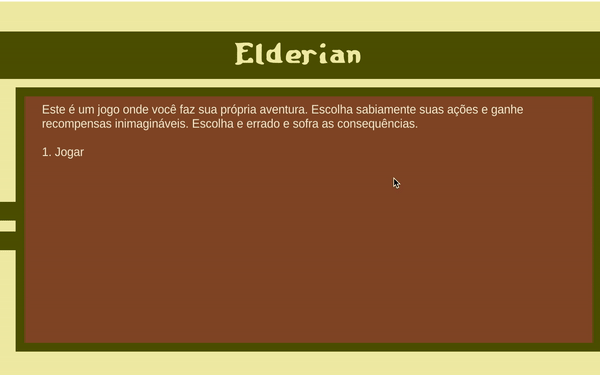

# Unit 2D Projects

This folder contains some Unity 2D projects made while doing a Udemy course.

# Projects

Some of the projects have the executable, so you can try the actual game.

## 1. Introduction

This project is an introduction to Unit2D, and uses the console to make a guess game, where the game will try to guess a number chosen by the player.

## 2. Text Adventure

This project intend to implement a state machine in Unity. This is a textual adventure where the player can choose what it will do in the story.

### Demo

The demo has only a few states just to prove that the state machine actually work.

[Play demo (version 0.01)](./TextAdventure/Build/Elderian_0.01)

## 3. Number Wizard

THis project intend to teach how to deal with Buttons and Scenes transictions. This game tries to guess a number that the player thought. The player gives the information about the guess given by the game being higher or lower than the thought number.

[Play game (version 0.01)](./WizardNumber/WizardNumber/Build/NumberWizard_0.01)

## 4. Block Breaker

This project is a block breaker type of game, where I learned about gravity, instantiating game
objects, prefabs, audio, and other concepts. You should control a pad that will rebounce a ball that
should hit some blocks in order to break them.

[Play game (version 0.01](./BlockBreaker/Build/BlockBreaker)
